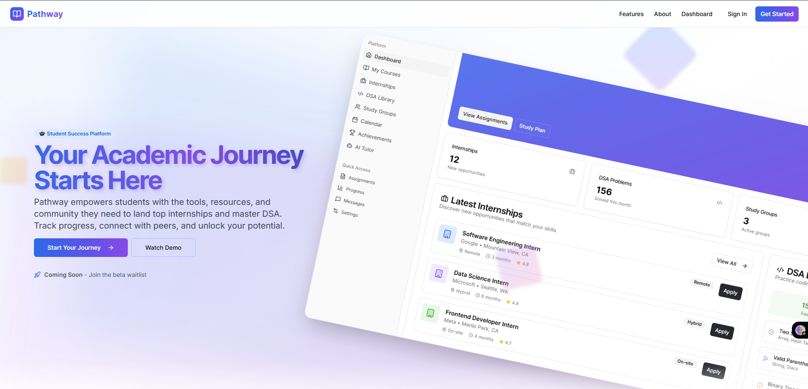

# **Pathway**

**Pathway** is an application that empowers students with the tools, resources and community they need to land top internships and master DSA.

**In Progress*

---

## App Preview

<!-- Add a screenshot of your app UI here -->
  

---

## Features

- **Internship Hub** – Track internship opportunities, monitor your application progress and stay on top of important deadlines
- **AI Tutor** – Ask questions, clear doubts, or get DSA help in real-time.
- **Peer Connect** – Collaborate, form study groups and grow together.
- **Progress Dashboard** – Visualize your journey and stay motivated.
- **Resource Hub** – Discover handpicked resources and prep guides.

---

## Tech Stack

- **Frontend:** Typescript, Tailwind CSS  
- **Backend:** Firebase Auth
- **Database:** Firestore  
- **Hosting:** Vercel
- **Extras:** GitHub, Figma

---

## Getting Started

To run Pathway locally:

```bash
git clone https://github.com/manubhavsar/pathway.git
cd pathway
npm install
npm run dev
